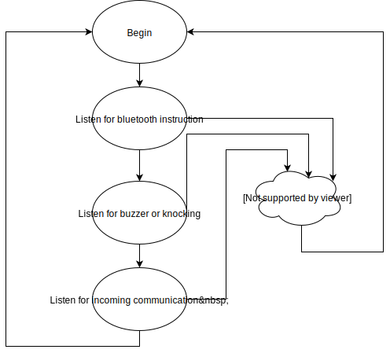

# EMT2461-Final-Project

# IoT-DoorPhone
Use existing infrastructure and software to create an internet connected DoorPhone
This project started out of the need to let guests into the building while my wife and I are at work.
The concept is simple: To add internet connectivity to our existing intercom system without hacking the system in place.
The IoT-DoorPhone may be installed either in the unit such that it interacts with the existing intercom, or it may be installed at the door.

