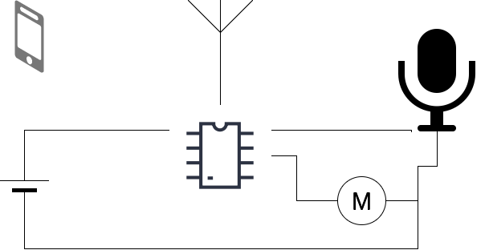

# EMT2461-Final-Project
The files in this repository are from our group's final project in our EMT2461 course. I am retroactively calling the project the RingberryDuino because it packs functionality similar to "Ring" using a Raspberry Pi and Arduino. While it is possible to acheive the same sans the Arduino and bluetooth link thereto, we threw them in to satisfy project requirements.

# IoT-DoorPhone
Use existing infrastructure and software to create an internet connected DoorPhone
This project started out of the need to let guests into the building while my wife and I are at work.
The concept is simple: To add internet connectivity to our existing intercom system without hacking the system in place.
The IoT-DoorPhone may be installed either in the unit such that it interacts with the existing intercom, or it may be installed at the door.

